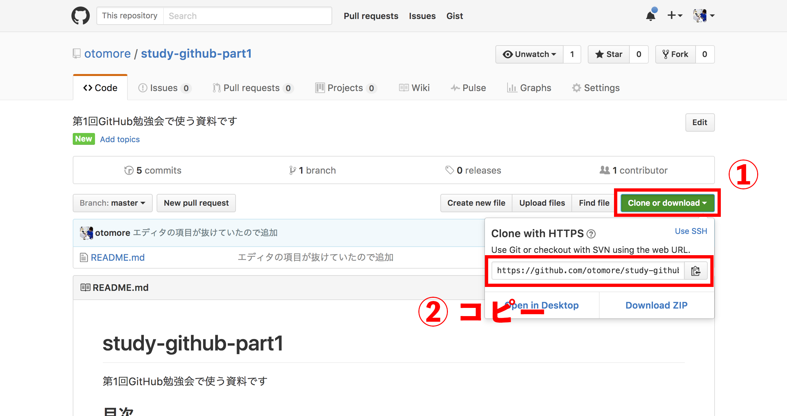

# study-github-part1
第1回GitHub勉強会で使う資料です

## 目次
- [ ] 開発環境
- [ ] 今回目指すもの
- [ ] Gitとは
- [ ] GitHubとは
- [ ] GitHubアカウントを作る
- [ ] リポジトリを作る
- [ ] [ターミナルにGitをインストールする](#ターミナルにgitをインストールする)
- [ ] Gitの初期設定
- [ ] さっき作ったリポジトリをクローンする
- [ ] エディタをインストールする(Atom)
- [ ] とりあえずREADME.mdを書く
- [ ] ローカルからリモートにコミット、プッシュ
- [ ] マークダウン記法とは
- [ ] READMEに書くべきこと
- [ ] GitHub Pagesの説明
- [ ] hugoの説明
- [ ] gulpの説明

## 開発環境
|||
|:-:|:-:|
|OS|macOS|
|エディタ|[Atom](https://atom.io/)|

## 今回目指すもの

とりあえずリポジトリを作って、pushしてみる。

## Gitとは

>git（ギット）は、プログラムのソースコードなどの変更履歴を記録・追跡するための分散型バージョン管理システムである。Linuxカーネルのソースコード管理に用いるためにリーナス・トーバルズによって開発され、それ以降ほかの多くのプロジェクトで採用されている。  
(出典：[Wikipedia](https://ja.wikipedia.org/wiki/Git))

### つまり

- 分散型バージョン管理システムの一つ
- ファイルの状態を更新履歴として保存できる
- 過去の状態に戻したり、編集箇所の差分を表示したりできる -> **バックアップになる**
- 複数人で **作業を共有** できる
- 近年の **バージョン管理システムの主流**

## GitHubとは

>GitHub（ギットハブ）はソフトウェア開発プロジェクトのための共有ウェブサービスであり、Gitバージョン管理システムを使用する。 Ruby on RailsおよびErlangで記述されており、GitHub社によって保守されている。...(中略)...2009年のユーザー調査によると、GitHubは最もポピュラーなGitホスティングサイトとなった。  
(出典：[Wikipedia](https://ja.wikipedia.org/wiki/GitHub))

### つまり

- ソフトウェア開発プロジェクトのための共有ウェブサービス
- Git + **SNS**
- **リポジトリ** を **クローン** し、ファイルを追加(変更)し、**コミット** し、**プッシュ** する。
- **プルリクエスト** を送ると他の人に **レビュー** され、master **ブランチ** に **マージ** し、最終的に本番環境へと **デプロイ** される

## GitHubアカウントを作る

https://github.com にアクセスしたら`username` `email address` `password`を入力してください。  
今回`username`に学籍番号「k14???kk」「x14???xx」やそれに近いものは **禁止** とします。ハンドルネームやイニシャルを捩󠄁(もじ)るなどして貴方のことが一発でわかるような文字列にしてください。

チームに`k14095kk`のような似たような表示名の人が何人もいたら、見間違えるかもしれないでしょう？

話が逸れましたが、入力できたら「Sign up for GitHub」をクリックしてください。

Step 2では「~ for free」が選択されていることを確認したら「Continue」をクリックして次に進みます。

Step 3ではアンケートに回答をします。一応訳を書いておきます。

#### How would you describe your level of programming experience? (プログラミング経験はどのくらい？)
- Totally new to programming (できない)
- Somewhat experienced (ﾁｮｯﾄﾃﾞｷﾙ)
- Very experienced (ﾅﾝﾃﾞﾓﾃﾞｷﾙ)

#### What do you plan to use GitHub for? (GitHubをどのように使う予定ですか？ 複数回答可)
- Development (開発)
- School projects (学校のプロジェクト)
- Project Management (プロジェクト管理)
- Design (設計/デザイン)
- Research (研究)
- Other (please specify) (その他・具体的に)

#### Which is closest to how you would describe yourself? (あなた自身が一番近いものは？)

- I'm a professional (この道のプロです)
- I'm a hobbyist (趣味でやってます)
- I'm a student (学生です)
- Other (please specify) (その他・具体的に)

#### What are you interested in? (何に興味がありますか？)
<br/>
<br/>
学生だと申請して通れば特典が受けられるので、学生を選んでおくのが無難でしょう。この申請は必要であれば各自でやっておいてください。  
入力したEmailアドレスにGitHubからメールが届くので確認しURLを開きます。アカウントが有効化されたら完了です！

## リポジトリ(保管庫)を作る

「**Start a project**」をクリックして次に進みます。  
「Repository name」にリポジトリ名を入力してください。何でもいいですが困ったら`my-first-repository`とでもしてください。
「Description」にはリポジトリの説明を短く書きます。これも困ったら`最初のリポジトリです`とでもしてください。

「Public」が選択されていて、「Initialize this repository with a README」のチェックが外れていることを確認したら「None」のまま「**Create repository**」をクリックしましょう。

おめでとうございます、これでリポジトリが作成されました！

ちなみに、privateリポジトリを作成してこっそり開発するには有料プランに登録する必要がありますが、[GitHub Education](https://education.github.com/)に申請し通れば無料で作成することができるようになります。英語で利用目的を書かなければなりませんが、2〜3行書くだけで(僕の場合は)通ったのでハードルは高くないと思います。

## ターミナルにGitをインストールする

リポジトリを操作するにはいくつか方法がありますが、今回はMacのターミナル.appから行います。GUIで(=視覚的に)操作できるものだとSourceTreeあたりが有名ですので興味があれば調べてください。

ターミナルにGitをインストールする方法は2通りあります。

1つは[Git](https://git-scm.com/)にアクセスしてダウンロードする方法。

もう1つはHomebrew経由でインストールする方法(ホームブルーと読むのが正しいらしいよ)。
Homebrewは入れておいて損はないと思うので今回はこちらをおすすめします。
まず、[Homebrew公式サイト](http://brew.sh/index_ja.html)に表示されているコマンドをコピペしてターミナル上で実行します。インストールが完了したら、  
```
$ brew doctor
```
を実行して問題なくインストールされたかチェックします。  
```
$ brew install git
```
でGitをインストールしていきます。
インストールが完了したら  
```
$ git --version
```  
で問題なくインストールできているか確認してください。もし過去にGitをインストールしたことがあれば古いバージョンが表示される可能性があります。その場合は /etc/paths を編集する必要があります。

## Gitの初期設定

最初にすべきことはユーザー名とE-mailアドレスを設定することです。

```
$ git config --global user.name "John Doe"
$ git config --global user.email johndoe@example.com
```

設定を確認しておきましょう。

```
$ git config --list
```


## さっき作ったリポジトリをクローンする

先程のリポジトリのページを開いてURLをコピーします。


```
$ cd {クローンしたディレクトリに移動}
$ git clone {コピーしたURL}
```

これでローカルにクローン(複製)されました。

```
$ cd {ディレクトリ名}
```

で中に移動しておきましょう。

```
$ ls -al
```

で中身を確認できます。

## エディタをインストールする(Atom)

好きなエディタで構いませんが、Markdownがプレビューできるエディタを推奨します。特にこだわりがなければAtomをインストールします。

Atomを起動してから、メニューバーからAtom -> Install Sell Commandsを選ぶとターミナルから起動できるようになります。

## とりあえずREADME.mdを書く

```
$ atom README.md
```

でREADME.mdを開きます。  
GitHubのREADME.mdは **Markdown記法** という書き方で記述する必要があります。  
知らなかった人でも簡単で、覚えやすいです。  

> [Markdown記法 チートシート](http://qiita.com/Qiita/items/c686397e4a0f4f11683d)

リポジトリの説明（架空の設定でOK）を書いてみてください。
本番のリポジトリでは以下のことが書いてあるといいですね。

- Name (プロジェクトやツールの名称)
- Overview (概要を一言で書く)
- Description (概要で伝わらない場合にもう少し丁寧な説明を書く)
- Demo (アニメGIFなどで動作例を見せる)
- VS. (類似ツールとの比較)
- Usage (使い方、コマンドのオプションなど)
- Install (インストール方法)
- Licence (ライセンス、著作権について)

## リモートリポジトリにpushしてみよう
初回は

```
git push --set-upstream origin master
```

と打ちましょう。ターミナル側でログインを求められます。

```
Username for 'https://github.com' {ユーザ名}
Password for 'https://otomore@github.com':{パスワード}
```

もしエラーが出たらエラー内容をコピペして **とりあえずググる** ことを覚えておきましょう。
